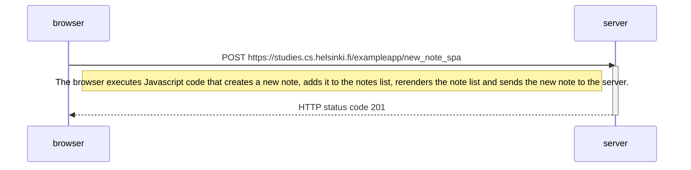

```mermaid
sequenceDiagram
    participant browser
    participant server

    browser->>server: POST https://studies.cs.helsinki.fi/exampleapp/new_note_spa
    activate server
    
    Note right of browser: The browser executes Javascript code that creates a new note, adds it to the notes list, rerenders the note list and sends the new note to the server.
    
    server-->>browser: HTTP status code 201
    deactivate server

```
